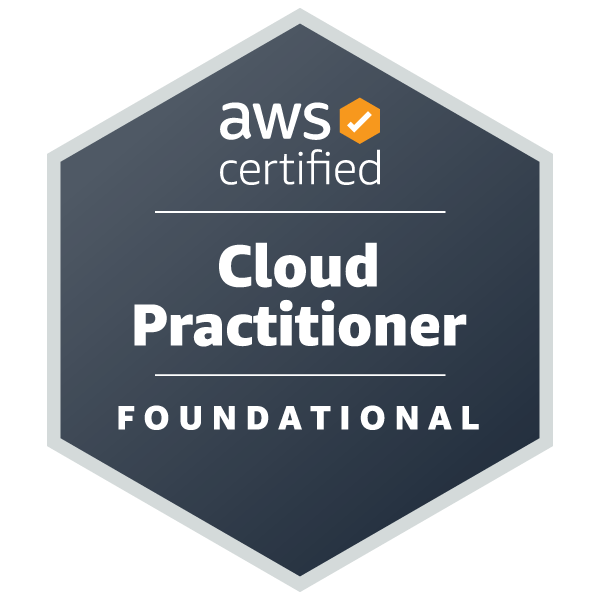
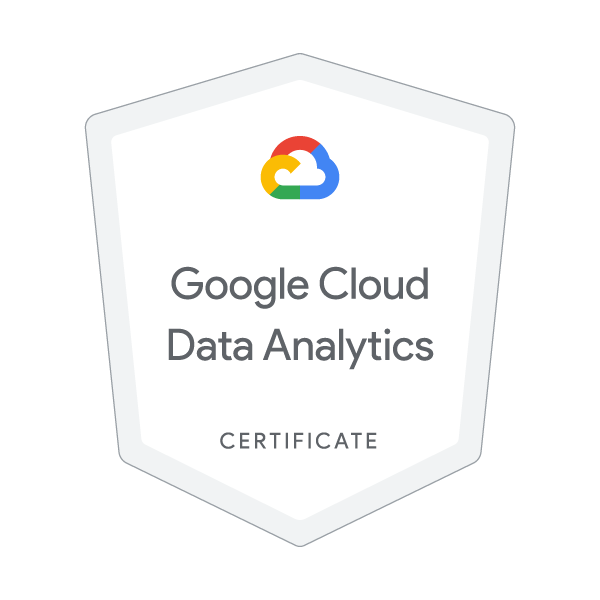
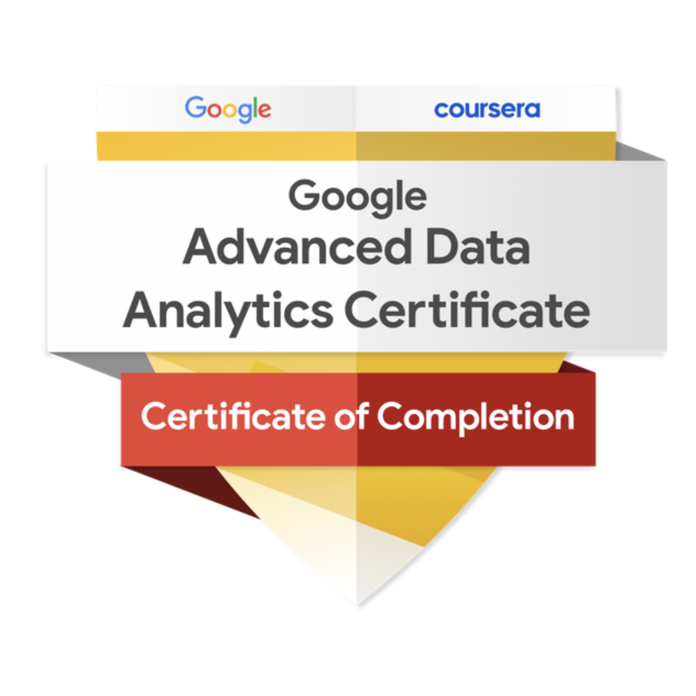

# 👋 Hola, soy Daniel Gomez

## 🎓 Data Analyst
- 🛠️ Experiencia en **SQL, Python, Power BI y Excel**.  
- 📊 Interés en **Ingeniería de datos, visualización y optimización de procesos**.  
- 🚀 Actualmente trabajando en un proyecto de **analítica de datos para una ONG de donación de alimentos**.  
- 🌱 Aprendiendo sobre **DBT**.  
- 🤝 Abierto a colaborar en proyectos de **Data Analysis** y **Business Intelligence**.  

## 🧰 Tecnologías y herramientas

  
  
  
  
  
  

## 📜 Certificaciones y Credenciales

  <!-- Badge AWS Cloud Practitioner -->
  
  &nbsp;&nbsp;
  <!-- badge Google Cloud Data Analytics Certificate -->
  
  &nbsp;&nbsp;
  <!-- badge Google Advance data analytics -->
  
  <!-- badge Power BI -->
  
  &nbsp;&nbsp;

> 🎓 Puedes verificar todas mis certificaciones oficiales en mis perfiles de [Credly](URL_A_TU_PERFIL_DE_CREDLY) y [OpenBadges](URL_A_TU_PERFIL_DE_OPENBADGES).
> 
## 📂 Proyectos destacados
- 📌 **Google Cloud Data Project** – Proyecto de Analisis de Datos con Google Cloud: ingesta, procesamiento y visualización de datos usando BigQuery y Looker 
- 📌 **Banco de Alimentos** – Proyecto de analitica end to end para una ONG.
- 📌 **Power BI Tailwind Trader** – Proyecto Power BI - Tailwind Trader: creación de reportes interactivos de ventas y productos para una empresa de retail.
- 📌 **UC_Davis_SQL_Capstone** – Análisis olímpico con SQL: participación, rendimiento y medallas.

## 📫 Contacto

  
  

---
